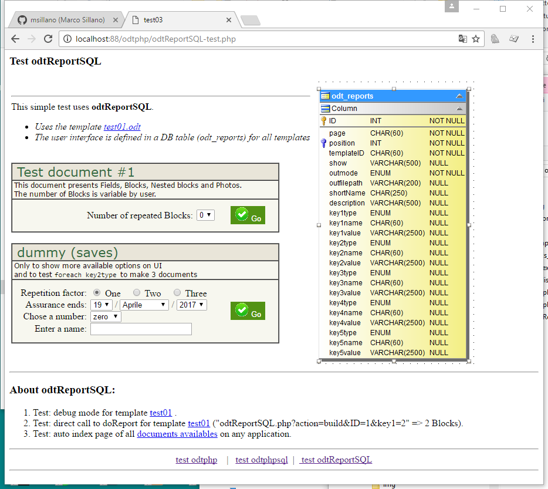
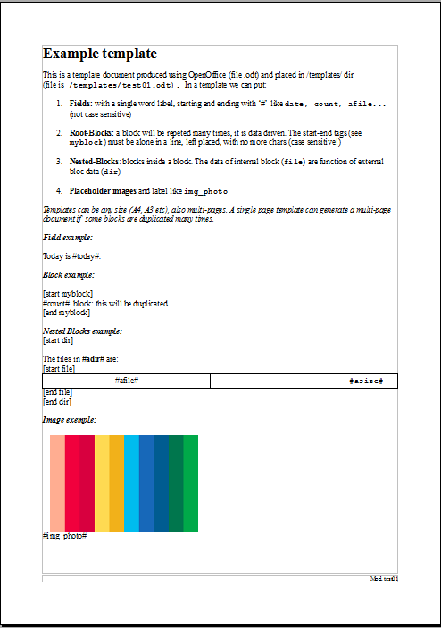
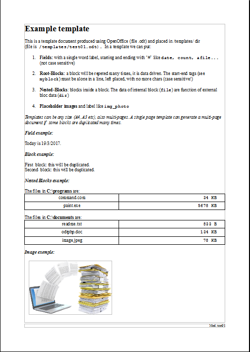

# odtReportSQL
This scalable library defines a complete reports/documents system  for php-mySQL applications.

Features:
-  Based on templates created using OpenOffice (.odt files)
-  Templates can be of any size (A4, A3...) and multipage.
-  On templates this system can do:
*       Simple substitution based on couples #field#/value.
*       Blocks and nested blocks duplication (any deep) or deletion.
*       Pictures substitution.
-  The HTML User Inteface is build by System and can be easy added at an existing php application. Add 2 lines ( see odtReportSQL-test.php)
*           <?php  include('odtReportSQL.php'); ?>
*           <?php  echo getReportMenu('this_page'); ?>
-  This system is DB driven, using 2 tables to define all templates substitutions and UI
-  Scalable:
*      odtphp.php defines template substitution engine
*      odtphpsql.php adds substitution queries definitions in DB
*      odtReportSQL.php adds an UI defined in DB
-  Any document as an URL definition.
-  To add a new document is only required to make the new template and to update the DB.
-  The resulting documents can be open using OpenOffice and saved in almost any format.
 
This system was developped to be used with a school examinations management software, with more than 25 different documents (letters, certificates, ufficial records, grade tables, notices...) from 1 to 68 pages.

see install.txt.

TODO
- More translations (files language_xx.php).
- More DB Interfaces (file commonSQL.php)
